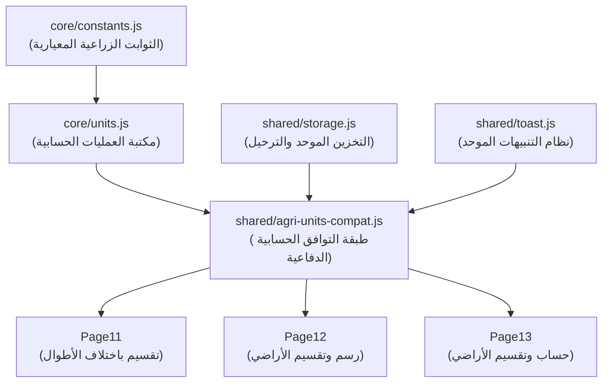

# وثيقة معمارية برنامج الدَّلاَّل (Architecture & Developer Guide)

برنامج الدَّلاَّل هو تطبيق ويب متطور لحسابات وتقسيم الأراضي الزراعية للفلاح والمزارع والمساح. تم تحديث معمارية النظام لتعتمد على بنية موحدة وموثوقة تفصل بين منطق النواة (Core) والخدمات المشتركة (Shared) وطبقات التوافق والصفحات الرسومية.

---

## 1. مخطط التبعيات (Dependency Graph)

يوضح المخطط التالي كيفية تسلسل تحميل وتشغيل مكتبات النظام والتزامها بترتيب تحميل محدد لمنع أخطاء المتغيرات غير المعرفة:

---

## 2. المكونات الرئيسية للنظام (Core Components)

### أ. النواة (Core Layer)
تضم الدوال الحسابية الخالية من أي ارتباط ببيئة المتصفح (Pure Functions) لتسهيل نقلها إلى بيئات تشغيل أخرى مثل Flutter مستقبلاً:
1. **[constants.js](file:///F:/%D8%A8%D8%B1%D9%85%D8%AC%D8%A9%20%D8%AA%D8%B7%D8%A8%D9%8A%D9%82%20%D8%A7%D9%84%D8%AF%D9%84%D8%A7%D9%84/qiasat-aradi-master/core/constants.js):** يحتوي على الثوابت الرياضية والهندسية للقياسات (مثل طول القصبة، والقبضة، ومساحات القراريط والأسهم).
2. **[units.js](file:///F:/%D8%A8%D8%B1%D9%85%D8%AC%D8%A9%20%D8%AA%D8%B7%D8%A8%D9%8A%D9%82%20%D8%A7%D9%84%D8%AF%D9%84%D8%A7%D9%84/qiasat-aradi-master/core/units.js):** كائن `AgriUnits` الذي يوفر دوال التحويل القياسية بين الوحدات (متر مربع ↔ فدان/قيراط/سهم) و (متر ↔ قصبة/قبضة) مع معالجة رياضية فائقة الحساسية للقيم العشرية والحدودية.

### ب. الخدمات المشتركة (Shared Services)
مجموعة أدوات تحسين تجربة المستخدم وإدارة البيانات:
1. **[storage.js](file:///F:/%D8%A8%D8%B1%D9%85%D8%AC%D8%A9%20%D8%AA%D8%B7%D8%A8%D9%8A%D9%82%20%D8%A7%D9%84%D8%AF%D9%84%D8%A7%D9%84/qiasat-aradi-master/shared/storage.js):** كائن `DallalStorage` لإدارة `localStorage` و `sessionStorage` ببادئة موحدة (`dallal_`) لمنع التداخل، بالإضافة لآلية الترحيل التلقائي للمفاتيح التاريخية والمزامنة الثنائية (Dual-Write).
2. **[toast.js](file:///F:/%D8%A8%D8%B1%D9%85%D8%AC%D8%A9%20%D8%AA%D8%B7%D8%A8%D9%8A%D9%82%20%D8%A7%D9%84%D8%AF%D9%84%D8%A7%D9%84/qiasat-aradi-master/shared/toast.js):** كائن `DallalToast` لإظهار رسائل وتنبيهات تفاعلية بتصميم عصري وألوان متناسقة دون الحاجة لمكتبات خارجية.

### ج. طبقة التوافقية (Compatibility Layer)
1. **[agri-units-compat.js](file:///F:/%D8%A8%D8%B1%D9%85%D8%AC%D8%A9%20%D8%AA%D8%B7%D8%A8%D9%8A%D9%82%20%D8%A7%D9%84%D8%AF%D9%84%D8%A7%D9%84/qiasat-aradi-master/shared/agri-units-compat.js):** كائن `AgriUnitsCompat` الذي يعمل كواجهة وسيطة (Proxy/Wrapper) بين الصفحات وكائن النواة `AgriUnits` ليحمي الصفحات من أي تغيرات أو غياب للمكتبات.

---

## 3. قواعد ومعايير التطوير البرمجي (Development Standards)

### أ. البرمجة الدفاعية ومعالجة الأخطاء (Defensive Programming)
* يُمنع منعاً باتاً إلقاء استثناءات (`throw`) مباشرة داخل سكريبتات الصفحات الرسومية لتجنب انهيار الصفحة بالكامل في بيئة الإنتاج.
* تقع مسؤولية التحقق والاحتياط بالكامل داخل مكتبات التوافق (`agri-units-compat.js`) وفق السلوك التالي المعتمد على وضع التطوير `window.DALLAL_DEBUG`:
  * **في وضع التطوير (`window.DALLAL_DEBUG === true`):** يتم إلقاء الخطأ مباشرة لمساعدة المطور على تتبعه وإصلاحه فوراً.
  * **في وضع الإنتاج (إيقاف وضع التطوير):** يتم تسجيل الخطأ في كونسول المتصفح (`console.error`) وإرجاع قيمة افتراضية آمنة (مثل رقم أو كائن فارغ) لمنع كسر تجربة المستخدم.

### ب. قاعدة الحظر الصارم وإيقاف الأكواد القديمة (Zero-Dependency Deprecation Rule)
لا يجوز حذف أي كود أو دالة قديمة (`legacy*`) نهائياً من ملفات المشروع إلا بتوافر الشرطين التاليين معاً:
1. **Zero References:** خلو كامل المشروع من أي استدعاء أو استخدام مباشر أو غير مباشر للدالة القديمة.
2. **Zero Runtime Dependency (المرحلة الانتقالية):** تشغيل المشروع بالكامل، وتمرير كافة اختبارات الوحدات (Unit Tests) واختبارات التكامل (Integration Tests) واختبارات التراجع (Regression Tests) بنجاح كامل بنسبة 100%، وإصدار نسخة مستقرة كاملة تعمل مع الإبقاء على الأكواد القديمة معلمة بوسم `@deprecated` لفترة إصدار كامل قبل حذفها الفعلي في المرحلة التالية.

---

## 4. نظام الاختبارات (Testing System)

ينقسم نظام الاختبارات في المشروع إلى نوعين رئيسيين:
1. **اختبارات الوحدات (Unit Tests):** تقع في مجلد `tests/` وتستهدف التحقق الرياضي الدقيق لمنطق النواة (AgriUnits) والحفظ الأساسي.
2. **اختبارات التكامل (Integration & Regression Suite):** تقع في مجلد `tests/integration/` وتقوم بالتحقق من انتقال البيانات وحفظها تلقائياً وتفاعل الصفحات معاً، وتشمل:
   - **Load Order Test:** للتحقق من صحة تسلسل تحميل السكريبتات.
   - **Missing Library Test:** للتحقق من السلوك الدفاعي الآمن عند فقدان ملفات النواة.
   - **Version Compatibility Test:** للتأكد من توافق أرقام إصدارات المكتبات معاً.
   - **لوحة الاختبارات التفاعلية:** صفحة `tests/integration/index.html` لتشغيل كافة الاختبارات بنقرة واحدة داخل المتصفح.
