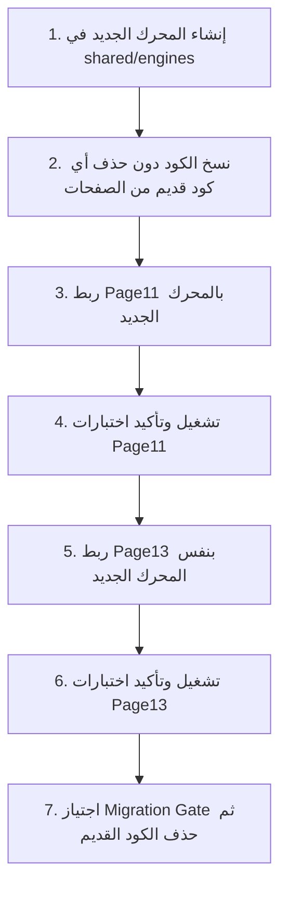

Document: ROADMAP_COMMIT13.md
Version: 1.0
Applies From: Commit 13.0
Status: Approved
Last Updated: 2026-07-21

# خارطة طريق Commit 13.x (الإصدار المعماري) 🏛️🗺️

تأسيسًا على نجاح **Commit 12.0** كإصدار مستقر ومرجعي (Release Candidate 1)، تهدف هذه الوثيقة إلى وضع خارطة طريق معمارية صارمة لتحويل تطبيق **الدَّلاَّل** من مشروع يعمل إلى **مشروع قابل للصيانة والتوسع (Maintainable & Scalable Architecture)**.

---

## 📚 وثائق الاعتماد التأسيسية
قبل بدء تنفيذ التطوير المعماري، تم استكمال الوثائق التأسيسية الحاكمية كاملة تحت المجلد `docs/`:
1. **[ADR.md (سجل القرارات المعمارية)](file:///f:/%D8%A8%D8%B1%D9%85%D8%AC%D8%A9%20%D8%AA%D8%B7%D8%A8%D9%8A%D9%82%20%D8%A7%D9%84%D8%AF%D9%84%D8%A7%D9%84/qiasat-aradi-master/docs/ADR.md):** توثيق القرارات المعمارية الاستراتيجية الحاكمة (`ADR-001` إلى `ADR-005`).
2. **[CODING_STANDARDS.md (معايير البرمجة)](file:///f:/%D8%A8%D8%B1%D9%85%D8%AC%D8%A9%20%D8%AA%D8%B7%D8%A8%D9%8A%D9%82%20%D8%A7%D9%84%D8%AF%D9%84%D8%A7%D9%84/qiasat-aradi-master/docs/CODING_STANDARDS.md):** توحيد ضوابط الجودة (البنود 1 إلى 12).
3. **[RELEASE_PROCESS.md (دورة النشر والـ Git Flow)](file:///f:/%D8%A8%D8%B1%D9%85%D8%AC%D8%A9%20%D8%AA%D8%B7%D8%A8%D9%8A%D9%82%20%D8%A7%D9%84%D8%AF%D9%84%D8%A7%D9%84/qiasat-aradi-master/docs/RELEASE_PROCESS.md):** قواعد الفروع وسلوك الدمج وبوابات النشر.
4. **[DOD.md (تعريف الاكتمال Definition of Done)](file:///f:/%D8%A8%D8%B1%D9%85%D8%AC%D8%A9%20%D8%AA%D8%B7%D8%A8%D9%8A%D9%82%20%D8%A7%D9%84%D8%AF%D9%84%D8%A7%D9%84/qiasat-aradi-master/docs/DOD.md):** الشروط التجميعية الصارمة لاعتماد أي Commit.
5. **[CHANGELOG.md (سجل التغييرات)](file:///f:/%D8%A8%D8%B1%D9%85%D8%AC%D8%A9%20%D8%AA%D8%B7%D8%A8%D9%8A%D9%82%20%D8%A7%D9%84%D8%AF%D9%84%D8%A7%D9%84/qiasat-aradi-master/docs/CHANGELOG.md):** توثيق التغييرات لكل إصدار.

---

## 🛡️ سياسة النقل الآمن وبوابة الترحيل (Migration Gate Policy)

لمنع حدوث أي توقف مؤقت أو كسر بالوظائف؛ يُعتمد **سير العمل الآمن ذو الخطوات السبع (7-Step Safe Migration Workflow)** لكل محرك من سلسلة 13.x:



---

## 🏗️ الهيكلية المعمارية الشاملة لمجلد `shared/`

```text
shared/
├── core/                       # الأساسيات والثوابت العامة
│   ├── constants.js            # الثوابت الموحدة (مساحات القراريط، النسب)
│   └── version.js              # معلومات رقم الإصدار والوسوم
├── utils/                      # الأدوات والمساعدات العامة
│   ├── formatters.js           # أدوات التنسيق الرقمي والنصي
│   ├── arabic-numerals.js      # المحول والمنسق للأرقام العربية
│   ├── geometry.js             # الحسابات والهندسيات المساعدة
│   └── validation.js           # أدوات الفحص الوقائي من NaN/Infinity
├── engines/                    # المحركات التخصصية المشتركة
│   ├── steps-engine.js         # محرك توليد خطوات الحساب التفصيلية
│   ├── report-engine.js        # محرك توليد وتنسيق التقارير
│   ├── croquis-engine.js       # محرك الرسم ومعالجة الأبعاد هندسياً
│   ├── calculation-engine.js   # محرك الحسابات والأنصبة الرئيسي (الحساس)
│   └── print-engine.js         # محرك تهيئة وتجهيز بيئة الطباعة
├── templates/                  # القوالب الموحدة
│   └── report-template.js      # قالب الطباعة الموحد
└── adapters/                   # المحولات التكيفية للصفحات
    ├── page11-adapter.js       # محول بيانات واجهة Page11
    └── page13-adapter.js       # محول بيانات واجهة Page13
```

---

## 🔄 الترتيب المعتمد لـ Commits سلسلة 13.x

| Commit | المحرك / الهدف | النطاق والوصف | بوابة الاعتماد |
| :--- | :--- | :--- | :--- |
| **Commit 13.1** | `steps-engine.js` | استخراج وتوحيد محرك خطوات الحساب بالتفصيل | 🚦 Migration Gate |
| **Commit 13.2** | `report-engine.js` | استخراج وتوحيد محرك التقارير وتوليد البيانات | 🚦 Migration Gate |
| **Commit 13.3** | `croquis-engine.js` | استخراج وتوحيد محرك الرسم والكروكي الهندسي | 🚦 Migration Gate |
| **Commit 13.4** | `calculation-engine.js` | استخراج وتوحيد محرك الحسابات والأنصبة (الأكبر والحساس) | 🚦 Migration Gate |
| **Commit 13.5** | `print-engine.js` | استخراج وتوحيد محرك الطباعة الموحد | 🚦 Migration Gate |
| **Commit 13.6** | `Performance Optimization` | تطبيق Debounce / Throttle / requestAnimationFrame / Cache | 🚦 Migration Gate |
| **Commit 13.7** | `Unified Regression Suite` | بناء شبكة الاختبارات الموحدة لكافة الصفحات | 🚦 Migration Gate |
| **Commit 13.8** | `New Features` | بدء إضافة الميزات الوظيفية الجديدة | 🚦 Migration Gate |

---

## 🚦 تسلسل بوابات الاعتماد قبل الدمج (Quality Gate Pipeline)

```text
Architecture Review ──► Code Review ──► Smoke Test ──► Regression Test ──► UAT ──► Merge
```

---

## 🎯 الهدف الأسمى لـ Commit 13.0
> **تحويل تطبيق الدَّلاَّل من تطبيق يعتمد على صفحات مستقلة المنطق، إلى بنية محركات مشتركة (Shared Engines) عالية المقاومة للمخاطر وقابلة للتوسع التام مستقبلاً.**
